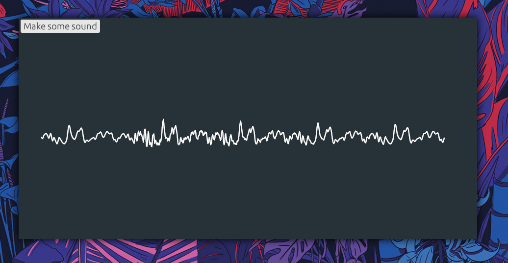

# Nosna synth

Nosna (from Polish word *nośna* - carrier) is a minimalist
phase modulation synthesiser written in Rust.

You can listen to a small demo of an old Nosna version [here](https://odysee.com/@Wint3rmute:c/nosna_wip_demo:e?r=BJqFSjMteohDSHxRkHYCu14FQ6V7aMQR).

*A quick screenshot, not actually FM/PM synthesis since I'm currently experimenting with Karplus-Strong :)*

## The idea

I've started writing Nosna as an Android application
for a university course. It turns out that making
a simple synthesizer was a very enjoyable experience for me,
so I've decided to RIIR.

## Features

- [ ] 3 operators with variable waveforms
- [x] ADSR envelopes
- [ ] Built-in effects
- [x] Oscilloscope
- [ ] MIDI support:
  - [x] Note on/off
  - [-] Midi CC
  - [ ] Aftertouch and other expression

