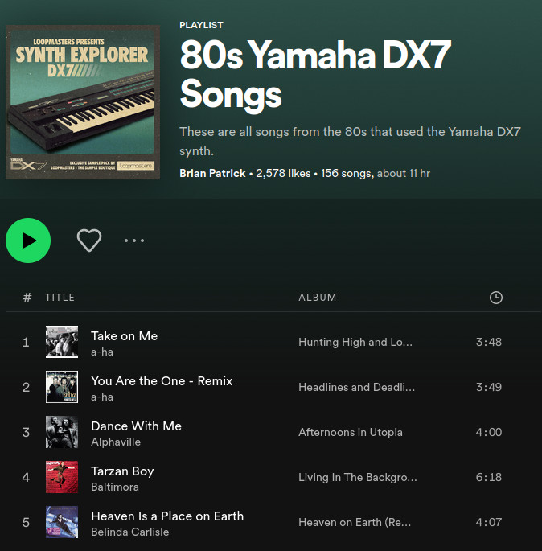
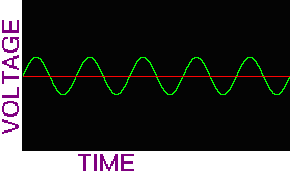
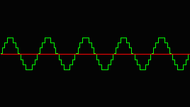

# *Nosna* Synth

A minimalist FM synthesiser

#
### Introduction

- I'm Mateusz Bączek:
  - I program things that fly 🛰️ (mostly)
  - I'm a semi-amateur musician 🎹
  - I enjoy hard sci-fi and popular philosophy 📚
  - Linux, Python and Rust are my tools 🛠️

 
You can read more at [baczek.me](https://baczek.me)

#
### What we're gonna build today

- FM (actually PM) synth 
- Polyphonic (as many voices as the CPU can handle)
- MIDI support
  - Playing notes
  - Tweaking controls
- All in **Rust**

#
### Inspiration

Yamaha DX7 (1983)

#
#### You've definitely heard it before

#
### How to make the computer beep

(Images from the [ALSA](https://www.alsa-project.org/alsa-doc/alsa-lib/pcm.html) project documentation)

# 
### Important words to remember

- PCM - Pulse-Code Modulation
- Sampling rate - how often we generate a new sample

#
### First steps with Rust

Generating a sine wave using the `rodio` library.

